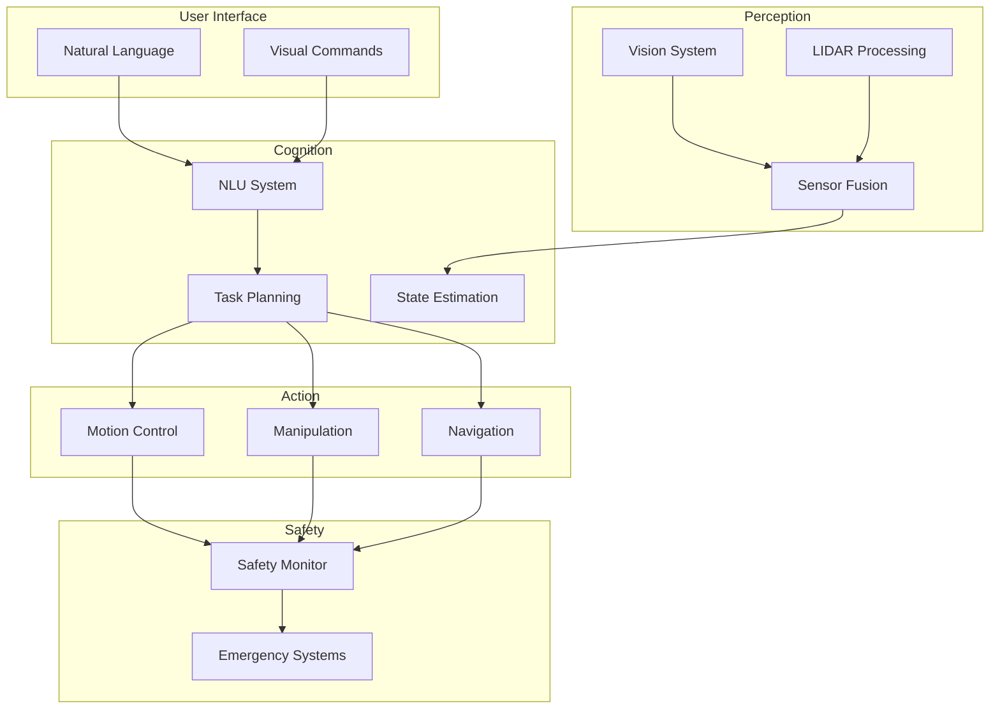

# Presentation Guidelines

## Introduction to Capstone Presentation

The capstone project presentation is the culmination of the autonomous humanoid system development process. This presentation demonstrates the integration of all course concepts into a functional system while showcasing technical skills, problem-solving abilities, and professional communication. The presentation serves as both a technical demonstration and a professional milestone that prepares students for industry presentations.

## Presentation Structure

### Executive Summary (2-3 minutes)

Begin with a compelling executive summary that captures the audience's attention:

**Opening Hook:**
- Present a real-world scenario that your system addresses
- State the problem in clear, non-technical terms
- Highlight the significance of the solution

**Project Overview:**
- Brief system description and capabilities
- Key technical achievements
- Primary outcomes and metrics

**Example Opening:**
"Imagine an elderly person needing assistance with daily tasks, or a factory requiring flexible automation solutions. Today, I'll demonstrate our autonomous humanoid system that bridges the gap between human-like interaction and robotic precision, capable of understanding natural language commands and performing complex physical tasks safely and effectively."

### Technical Architecture (5-7 minutes)

Present the system architecture with clear visual aids:

**System Overview:**
- High-level architecture diagram
- Major components and their functions
- Data flow and integration points

**Component Deep Dive:**
- Perception system capabilities
- Cognition and decision-making processes
- Action and control systems
- Safety and reliability mechanisms

**Integration Strategy:**
- How components work together
- Key integration challenges and solutions
- Performance optimization techniques

### Demonstration (8-10 minutes)

The demonstration is the centerpiece of your presentation:

**Live Demo Preparation:**
- Have backup demonstrations ready
- Practice transitions between demo steps
- Prepare for potential technical issues
- Time demonstrations appropriately

**Demo Scenarios:**
- Start with simple, reliable tasks
- Progress to more complex behaviors
- Include safety system demonstrations
- Show human-robot interaction

**Narration Strategy:**
- Explain what the system is doing
- Highlight technical achievements
- Point out safety features
- Connect to course concepts

### Results and Validation (3-4 minutes)

Present quantitative and qualitative results:

**Performance Metrics:**
- Task completion rates
- Response times
- Accuracy measurements
- Reliability statistics

**Validation Results:**
- Testing methodology
- Safety validation outcomes
- Performance benchmarks
- Comparison to requirements

**Lessons Learned:**
- Technical challenges overcome
- Unexpected discoveries
- Areas for improvement

### Future Work and Conclusions (2-3 minutes)

End with forward-looking statements:

**Future Enhancements:**
- Planned improvements
- Technology roadmap
- Research directions

**Project Impact:**
- Significance of achievements
- Real-world applications
- Professional development gained

## Presentation Preparation

### Content Development

#### Storytelling Framework

Use a narrative structure to make your presentation engaging:

**The Challenge:**
- Define the problem space
- Explain why it matters
- Set context for your solution

**The Journey:**
- Describe the development process
- Highlight key challenges
- Explain solution approaches

**The Solution:**
- Present your system
- Demonstrate capabilities
- Validate effectiveness

**The Impact:**
- Discuss outcomes
- Address broader implications
- Connect to future applications

#### Technical Depth Balance

Balance technical detail with accessibility:

**For Technical Audience:**
- Deep technical explanations
- Algorithm details
- Performance metrics
- Implementation challenges

**For Mixed Audience:**
- Focus on outcomes and impact
- Use analogies for complex concepts
- Emphasize practical applications
- Minimize jargon

### Visual Aids and Materials

#### Architecture Diagrams

Create clear, professional diagrams:

#### System Architecture Slides

**Slide 1: High-Level Architecture**
- Show overall system structure
- Highlight key components
- Indicate data flow

**Slide 2: Component Integration**
- Detail component interfaces
- Show communication protocols
- Illustrate data formats

**Slide 3: Safety Architecture**
- Emphasize safety systems
- Show redundancy and fail-safes
- Highlight emergency procedures

#### Demonstration Materials

**Video Demonstrations:**
- Create backup videos for each key capability
- Include slow-motion replays of complex actions
- Show before/after comparisons
- Demonstrate failure recovery

**Live Demo Setup:**
- Prepare multiple demonstration scenarios
- Have technical support available
- Test all equipment beforehand
- Plan for audience interaction

### Practice and Rehearsal

#### Rehearsal Schedule

**Week 1: Content Review**
- Practice technical explanations
- Time each section
- Identify areas needing improvement

**Week 2: Flow and Transitions**
- Focus on smooth transitions
- Practice demo transitions
- Work on timing consistency

**Week 3: Full Rehearsals**
- Conduct full run-throughs
- Practice with colleagues
- Refine based on feedback

#### Technical Rehearsal

**System Check:**
- Verify all components function
- Test demonstration scenarios
- Check backup systems
- Validate safety protocols

**Equipment Check:**
- Test presentation equipment
- Verify video/audio systems
- Prepare backup materials
- Check network connectivity

## Presentation Delivery

### Professional Presentation Skills

#### Voice and Delivery

**Voice Control:**
- Speak clearly and at appropriate volume
- Vary pace for emphasis
- Pause after key points
- Avoid filler words

**Body Language:**
- Maintain good posture
- Use purposeful gestures
- Make eye contact
- Move with purpose

#### Handling Questions

**Preparation Strategy:**
- Anticipate likely questions
- Prepare concise answers
- Practice explaining complex topics
- Know your system's limitations

**Response Technique:**
- Listen completely before responding
- Acknowledge good questions
- Provide direct, honest answers
- Admit when uncertain

### Technical Demonstration Best Practices

#### Live Demo Management

**Setup Strategy:**
- Arrive early for setup
- Test everything multiple times
- Have technical support on standby
- Prepare for various contingencies

**Audience Engagement:**
- Explain what to watch for
- Narrate the system's decision process
- Highlight technical achievements
- Connect to course concepts

**Contingency Planning:**
- Have backup demonstrations ready
- Prepare video alternatives
- Know how to handle failures gracefully
- Maintain composure under pressure

#### Safety Considerations

**Demonstration Safety:**
- Maintain safety perimeters
- Have emergency stop accessible
- Brief audience on safety measures
- Ensure adequate supervision

**System Safety:**
- Verify safety systems active
- Monitor system behavior
- Be prepared to intervene
- Explain safety features

## Evaluation Criteria

### Technical Content (40%)

**System Design (15%):**
- Architecture quality and integration
- Technical sophistication
- Innovation and creativity
- Problem-solving approach

**Implementation Quality (15%):**
- Code quality and documentation
- System performance
- Technical challenge complexity
- Solution effectiveness

**Validation Results (10%):**
- Testing thoroughness
- Performance metrics
- Safety validation
- Results presentation

### Presentation Quality (35%)

**Clarity and Organization (15%):**
- Logical flow and structure
- Clear explanations
- Effective visual aids
- Time management

**Professional Delivery (10%):**
- Confidence and poise
- Audience engagement
- Technical communication
- Q&A handling

**Demonstration Quality (10%):**
- Demo preparation and execution
- System reliability during demo
- Explanation of system behavior
- Technical achievement showcase

### Innovation and Impact (25%)

**Innovation Level (10%):**
- Novel approaches or solutions
- Creative problem-solving
- Technical innovation
- Unique system features

**Real-World Impact (10%):**
- Practical application potential
- Problem relevance
- Market/industry applicability
- Societal benefit

**Future Potential (5%):**
- Scalability considerations
- Technology roadmap
- Research contribution
- Professional development

## Common Mistakes to Avoid

### Technical Mistakes

**Over-Engineering:**
- Don't present overly complex solutions
- Focus on elegant, effective solutions
- Prioritize clarity over complexity
- Demonstrate practical effectiveness

**Insufficient Testing:**
- Don't present unvalidated systems
- Show comprehensive testing results
- Demonstrate reliability
- Address safety concerns

### Presentation Mistakes

**Poor Time Management:**
- Don't exceed allocated time
- Practice to ensure proper pacing
- Leave time for questions
- Prepare for timing adjustments

**Inadequate Preparation:**
- Don't wing the presentation
- Practice technical explanations
- Prepare for common questions
- Test all demonstrations

### Communication Mistakes

**Overuse of Jargon:**
- Don't alienate non-technical audience
- Define technical terms
- Use analogies when helpful
- Focus on outcomes, not just processes

**Lack of Confidence:**
- Don't undersell your achievements
- Practice confident delivery
- Emphasize your contributions
- Show pride in your work

## Post-Presentation Activities

### Documentation Completion

**Final Report:**
- Update system documentation
- Include presentation materials
- Add final test results
- Document lessons learned

**Code Documentation:**
- Complete code comments
- Update API documentation
- Create user guides
- Document system architecture

### Knowledge Transfer

**Mentorship:**
- Share insights with future students
- Document best practices
- Create learning materials
- Provide guidance to others

**Industry Connections:**
- Network with audience members
- Share contact information
- Discuss potential opportunities
- Follow up on connections

## Presentation Checklist

### Pre-Presentation

- [ ] System fully tested and functional
- [ ] Backup demonstrations prepared
- [ ] All equipment tested and ready
- [ ] Presentation materials finalized
- [ ] Practice sessions completed
- [ ] Emergency procedures reviewed
- [ ] Safety measures confirmed
- [ ] Backup plans established

### During Presentation

- [ ] Arrive early for setup
- [ ] Verify all systems operational
- [ ] Check safety protocols active
- [ ] Engage with audience
- [ ] Maintain professional composure
- [ ] Handle questions gracefully
- [ ] Demonstrate system capabilities
- [ ] Highlight technical achievements

### Post-Presentation

- [ ] Thank audience and answer questions
- [ ] Provide contact information
- [ ] Document presentation feedback
- [ ] Update project documentation
- [ ] Follow up on connections
- [ ] Celebrate achievements
- [ ] Plan next steps
- [ ] Reflect on experience

## Week Summary

This presentation guidelines document provides comprehensive guidance for delivering an effective capstone project presentation. It covers content structure, preparation strategies, delivery techniques, evaluation criteria, and best practices for technical demonstrations. Following these guidelines ensures that students can effectively communicate their technical achievements while demonstrating professional presentation skills essential for their future careers.