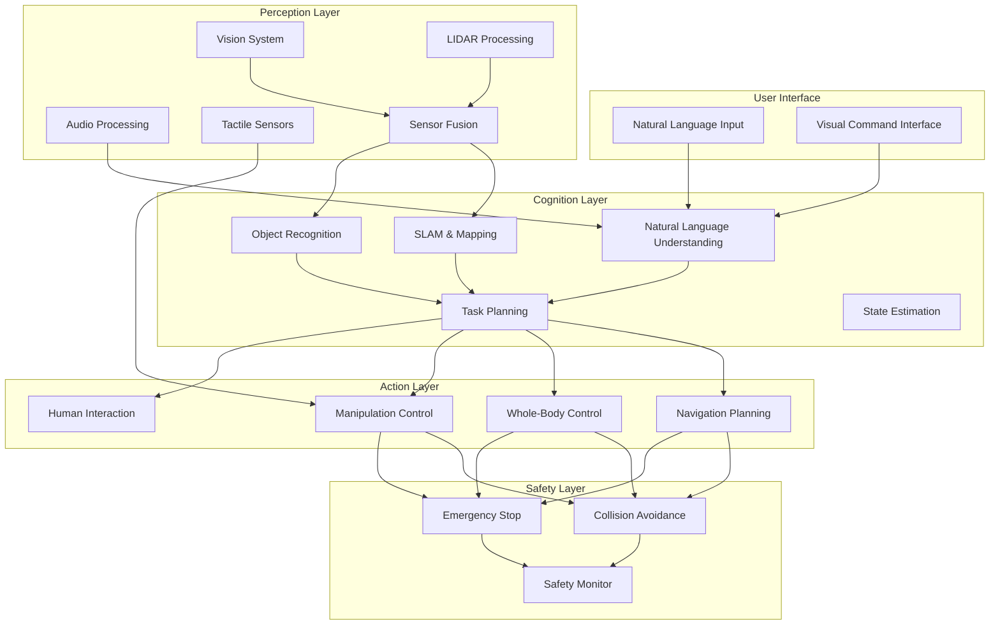

# Project Planning

## Introduction to Capstone Project Planning

Effective project planning is critical for the success of the autonomous humanoid system capstone project. This phase establishes the foundation for the entire project, defining requirements, architecture, timeline, and resource allocation. Proper planning ensures that all course concepts are effectively integrated into a cohesive, functional system.

## Project Scope Definition

### In Scope

**Core System Components:**
- Perception system with multi-modal sensor fusion
- Cognition system with natural language understanding
- Action system with motion control and manipulation
- Safety and emergency systems
- Human-robot interaction capabilities

**Key Capabilities:**
- Autonomous navigation in structured environments
- Object recognition and manipulation
- Natural language command interpretation
- Safe human interaction
- Task planning and execution

**Validation Requirements:**
- Simulation testing and validation
- Physical robot deployment (if available)
- Safety protocol verification
- Performance benchmarking

### Out of Scope

**Advanced Capabilities:**
- Full outdoor autonomy
- Complex social interaction beyond basic commands
- Advanced learning from human demonstration
- Multi-robot coordination beyond basic navigation

**Research-Only Components:**
- Novel algorithm development (focus on implementation)
- Fundamental research on core robotics problems
- Extensive optimization beyond functional requirements

## System Requirements

### Functional Requirements

**1. Navigation Requirements**
- Navigate through structured indoor environments
- Avoid dynamic obstacles (humans, moving objects)
- Localize within known maps
- Plan paths around obstacles

**2. Manipulation Requirements**
- Recognize and grasp common objects
- Perform basic manipulation tasks
- Handle objects with appropriate force
- Execute pre-programmed manipulation sequences

**3. Interaction Requirements**
- Understand natural language commands
- Provide feedback on task status
- Respond to basic social cues
- Maintain safe interaction distances

**4. Perception Requirements**
- Real-time object detection and classification
- Human detection and tracking
- Environment mapping and localization
- Multi-modal sensor fusion

### Non-Functional Requirements

**1. Performance Requirements**
- Real-time response: ≤100ms for safety-critical actions
- Task completion rate: ≥80% for defined tasks
- System uptime: ≥95% during operational hours
- Localization accuracy: ±5cm in known environments

**2. Safety Requirements**
- Emergency stop response: ≤50ms
- Collision avoidance: 100% success rate for static obstacles
- Human safety: Zero contact with humans during operation
- System failure handling: Graceful degradation

**3. Reliability Requirements**
- Mean time between failures: ≥8 hours
- Recovery time from minor failures: ≤2 minutes
- Data integrity: 100% during normal operation
- Communication reliability: ≥99% for critical systems

## System Architecture Planning

### High-Level Architecture

### Component Interfaces

**Perception-Cognition Interface:**
- Real-time sensor data streams
- Object detection results
- Environmental maps
- Human tracking information

**Cognition-Action Interface:**
- High-level task commands
- Navigation goals
- Manipulation targets
- Interaction parameters

**Action-Safety Interface:**
- Current state monitoring
- Safety constraint parameters
- Emergency stop triggers
- Collision detection results

## Project Timeline and Milestones

### Phase 1: System Design and Architecture (Weeks 1-2)

**Week 1: Requirements and Architecture**
- [ ] Finalize system requirements
- [ ] Design high-level architecture
- [ ] Define component interfaces
- [ ] Plan safety protocols
- [ ] Establish development environment

**Week 2: Detailed Design**
- [ ] Design individual components
- [ ] Plan integration strategy
- [ ] Define testing protocols
- [ ] Set up simulation environment
- [ ] Create project repository structure

### Phase 2: Component Development (Weeks 3-6)

**Week 3: Perception System Development**
- [ ] Implement vision processing pipeline
- [ ] Set up sensor fusion
- [ ] Develop object detection
- [ ] Integrate with ROS 2
- [ ] Basic testing and validation

**Week 4: Cognition System Development**
- [ ] Implement natural language processing
- [ ] Develop task planning algorithms
- [ ] Create state estimation
- [ ] Integrate with perception
- [ ] Testing with simulated data

**Week 5: Action System Development**
- [ ] Implement motion control
- [ ] Develop navigation system
- [ ] Create manipulation controllers
- [ ] Integrate with cognition
- [ ] Basic motion testing

**Week 6: Safety System Development**
- [ ] Implement safety monitoring
- [ ] Create emergency procedures
- [ ] Develop collision avoidance
- [ ] Integrate safety with all systems
- [ ] Safety validation testing

### Phase 3: System Integration (Weeks 7-10)

**Week 7: Basic Integration**
- [ ] Integrate perception-cognition
- [ ] Connect cognition-action
- [ ] Implement basic behaviors
- [ ] Test integrated pipeline
- [ ] Debug integration issues

**Week 8: Advanced Integration**
- [ ] Implement complex behaviors
- [ ] Optimize system performance
- [ ] Test safety integration
- [ ] Validate system responses
- [ ] Refine system parameters

**Week 9: System Validation**
- [ ] Comprehensive system testing
- [ ] Performance benchmarking
- [ ] Safety protocol validation
- [ ] User interaction testing
- [ ] Documentation updates

**Week 10: Optimization and Refinement**
- [ ] Performance optimization
- [ ] System tuning
- [ ] Reliability improvements
- [ ] Final validation tests
- [ ] Prepare for deployment

### Phase 4: Validation and Deployment (Weeks 11-13)

**Week 11: Simulation Deployment**
- [ ] Deploy in simulation environment
- [ ] Execute validation scenarios
- [ ] Performance analysis
- [ ] System refinement
- [ ] Documentation completion

**Week 12: Physical Deployment (if applicable)**
- [ ] Deploy on physical robot
- [ ] Execute real-world tests
- [ ] Safety validation
- [ ] Performance comparison
- [ ] System adjustments

**Week 13: Final Validation and Presentation**
- [ ] Final system validation
- [ ] Prepare demonstration
- [ ] Create final documentation
- [ ] Practice presentation
- [ ] Project submission

## Resource Planning

### Human Resources

**Team Composition:**
- Project Manager: Overall coordination and timeline management
- Perception Lead: Vision and sensor fusion development
- Cognition Lead: Language understanding and planning
- Action Lead: Control and manipulation systems
- Safety Lead: Safety systems and protocols
- Integration Lead: System integration and testing

**Roles and Responsibilities:**
- Daily stand-ups and progress tracking
- Weekly integration meetings
- Code review and quality assurance
- Documentation and reporting
- Risk management and mitigation

### Technical Resources

**Software Tools:**
- ROS 2 (Humble Hawksbill) for system integration
- Gazebo/Isaac Sim for simulation
- Python/C++ for development
- Git for version control
- Docker for environment consistency

**Hardware Requirements:**
- Development workstations with GPU support
- Robot platform (simulated or physical)
- Sensor equipment for testing
- Safety equipment and emergency systems
- Network infrastructure for communication

### Budget Considerations

**Development Costs:**
- Software licenses (if applicable)
- Cloud computing resources for simulation
- Hardware components for physical testing
- Safety equipment and materials
- Documentation and presentation materials

## Risk Management

### Technical Risks

**High Risk:**
- Integration complexity and component compatibility
- Real-time performance requirements
- Safety system reliability
- Hardware availability and reliability

**Medium Risk:**
- Algorithm performance in real-world conditions
- Sensor accuracy and reliability
- Communication latency and bandwidth
- Power consumption and management

**Low Risk:**
- Development environment setup
- Basic functionality implementation
- Documentation and reporting

### Mitigation Strategies

**Integration Risks:**
- Modular design with well-defined interfaces
- Extensive component testing before integration
- Gradual integration approach
- Comprehensive testing protocols

**Performance Risks:**
- Performance profiling and optimization
- Scalable architecture design
- Efficient algorithm implementation
- Resource monitoring and management

**Safety Risks:**
- Multiple safety layers and redundancy
- Extensive safety testing and validation
- Emergency procedures and protocols
- Continuous safety monitoring

## Quality Assurance Plan

### Testing Strategy

**Unit Testing:**
- Individual component testing
- Interface validation
- Performance benchmarking
- Edge case handling

**Integration Testing:**
- Component interaction testing
- System-level behavior validation
- Performance under load
- Safety system validation

**System Testing:**
- End-to-end functionality testing
- Real-world scenario validation
- Stress testing and reliability
- Safety protocol verification

### Documentation Requirements

**Technical Documentation:**
- System architecture diagrams
- Component specifications
- Interface definitions
- Safety protocols and procedures

**User Documentation:**
- Operation manuals
- Safety guidelines
- Troubleshooting guides
- Maintenance procedures

## Communication Plan

### Internal Communication
- Daily stand-ups (15 minutes)
- Weekly team meetings (1 hour)
- Technical review sessions (bi-weekly)
- Progress reporting (weekly)

### External Communication
- Stakeholder updates (bi-weekly)
- Advisor meetings (weekly)
- Progress presentations (milestone-based)
- Final demonstration (end of project)

## Success Metrics

### Quantitative Metrics
- Task completion rate: ≥80%
- System uptime: ≥95%
- Response time: ≤100ms for critical actions
- Safety incidents: Zero tolerance

### Qualitative Metrics
- System usability and user satisfaction
- Integration quality and cohesion
- Innovation and creativity in solutions
- Professional presentation quality

## Week Summary

This project planning document provides a comprehensive roadmap for the autonomous humanoid system capstone project. It defines scope, requirements, architecture, timeline, resources, and risk management strategies. Following this plan ensures systematic development and integration of all course concepts into a functional, safe, and effective autonomous system.